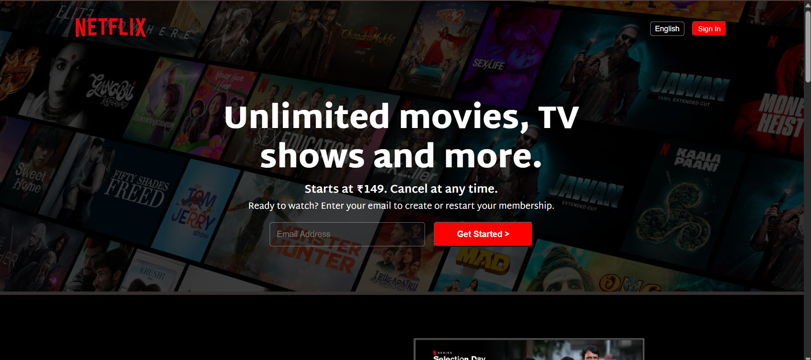

# Netflix Clone

A fully responsive **Netflix Clone** website built using only **HTML** and **CSS**. This project replicates the front-end design of Netflix's homepage, including a responsive navigation bar, hero section, featured content rows, and footer.

## 📸 Demo

## 🌟 Features

- Responsive layout for all devices: desktop, tablet, and mobile.
- Custom navigation bar with logo and menu items.
- Hero section with call-to-action buttons.
- Content rows styled like Netflix movie carousels.
- Clean and modern UI design.
- Built using pure HTML and CSS—no frameworks or JavaScript involved.

## 🛠️ Technologies Used

- HTML5
- CSS3 (Flexbox, Grid, Media Queries)

## 🚀 How to Use

You can directly view the live demo here:  
👉 [Netflix Clone Live Demo](https://netflix-clone-blush-pi.vercel.app/)
